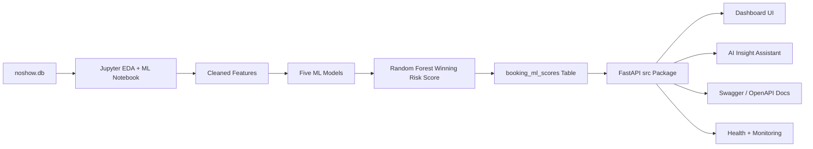
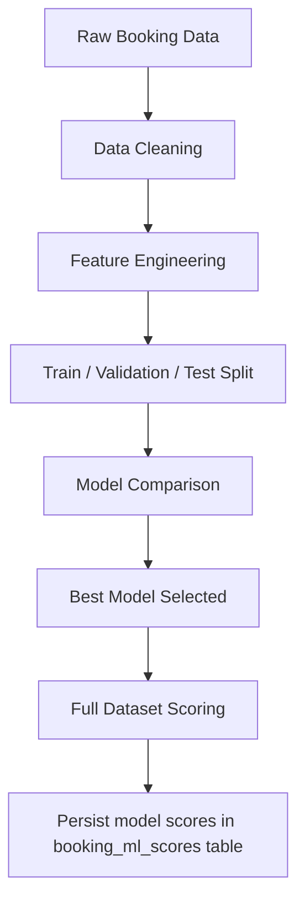
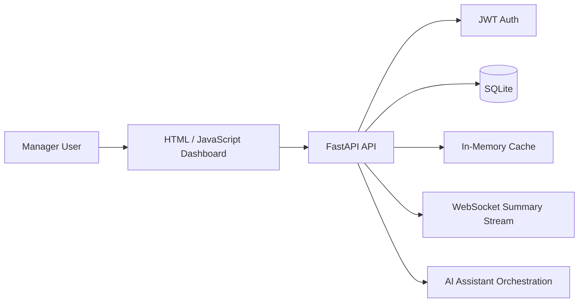

# Overall Project Architecture

## System Overview

## Data Flow

The notebook loads `noshow.db`, cleans the booking fields, standardizes month values, parses price values, creates customer and price-band features, and trains five real ML models plus a dummy baseline. The five real model scores are appended to `final_scored_df`.

The Random Forest ML model has the highest Precision-Recall Area under the Curve (PR-AUC) score and is selected to be displayed as the `risk_score` in the web dashboard. We also created categorical risk labels `Low`, `Medium`, and `High` according to the quantile distribution of the Random Forest ML model risk score. The notebook persists the final scored dataframe into SQLite as `booking_ml_scores`.

The FastAPI app reads from `booking_ml_scores` for the "Operational Queue" section of the dashboard. If the scored table is not available, the API returns a clear message asking the user to rerun the notebook ML scoring cell.

## Model Lifecycle

The current implementation demonstrates the end-to-end prototype lifecycle: the notebook trains candidate models, compares evaluation metrics, selects the best model, scores the full dataset, and persists booking-level scores for the FastAPI dashboard. 

For a production MLOps lifecycle, this flow would be extended with:

- experiment tracking for model parameters, datasets, train/test splits, and evaluation metrics
- a model registry to version approved models and record which model generated each `booking_ml_scores` refresh
- scheduled batch scoring or retraining jobs instead of manually rerunning the notebook
- drift monitoring for changes in booking mix, no-show rate, feature distributions, and prediction score distributions
- fairness and segment performance checks across countries, branches, platforms, and first-time customer status
- automated CI/CD tests for data validation, feature schema compatibility, API responses, and model performance thresholds
- deployment promotion gates so only validated model versions are released to the dashboard

## Application Architecture

The web app dashboard uses REST endpoints to query a SQLite db, segment drill-downs, operational queue rows, and assistant answers. A WebSocket stream refreshes summary KPIs. The API includes health, monitoring, authentication, rate limiting, OpenAPI documentation, and Docker support.

## Deployment Strategy

For local review, the app can be launched with `./run.sh` from `visa/app`. For containerized review, use `docker compose up --build`. Environment-specific settings are controlled through `.env` or environment variables such as `DATABASE_URL`, `JWT_SECRET`, `DEMO_USERNAME`, and `DEMO_PASSWORD`.
